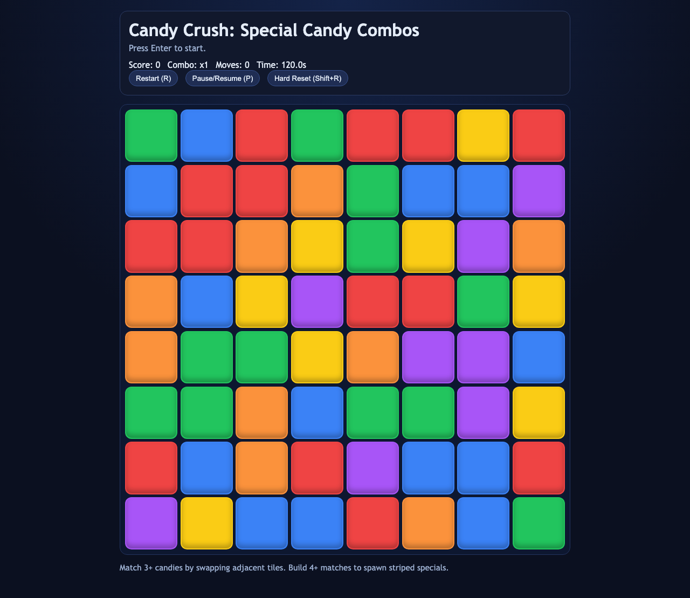

# daily-classic-game-2026-04-07-candy-crush-special-candy-combos

<div align="center">
  <p>A deterministic match-3 browser run inspired by Candy Crush Saga, rebuilt around a special-candy combo twist where 4+ matches mint striped candies that explode full rows and columns.</p>
</div>

<div align="center">
  <p>
    
    
    
  </p>
</div>

## GIF Captures

- `Opening Grid`: `artifacts/playwright/clip-opening-grid.gif`
- `Special Candy Combos`: `artifacts/playwright/clip-special-candy-combos.gif`
- `Pause Reset Cycle`: `artifacts/playwright/clip-pause-reset-cycle.gif`

## Quick Start

```bash
pnpm install
pnpm test
pnpm build
pnpm capture
```

## How To Play

Press `Enter` to begin. Click one candy and then a neighboring candy to swap them. Any 3+ line clears, falls, and refills immediately; 4+ lines generate striped specials that detonate a full row and column when cleared.

## Rules

- Only adjacent swaps are legal.
- Swaps that do not create a match are reverted.
- A run lasts `120` seconds.
- `P` toggles pause, `R` restarts, and `Shift+R` performs a hard reset to idle.

## Scoring

- Each cleared candy awards `10` points, multiplied by cascade depth.
- Triggering a striped special adds bonus score.
- Longer cascades increase combo multiplier.

## Twist

This run applies the catalog twist `Special candy combos`: every 4+ match spawns striped candies, shifting strategy from simple clears to chain planning where special detonations amplify cascade value.

## Verification

- `pnpm test`
- `pnpm build`
- `pnpm capture`
- Browser hooks:
  - `window.advanceTime(ms)`
  - `window.render_game_to_text()`

## Project Layout

- `src/game-core.js`: deterministic board generation, swap rules, cascade resolution, and scoring
- `src/main.js`: UI rendering, controls, and browser hooks
- `tests/game-core.test.mjs`: deterministic core checks
- `tests/capture.spec.mjs`: Playwright snapshots and standardized action payloads
- `artifacts/playwright/`: screenshots, GIF placeholders, action payloads, and rendered state dump
